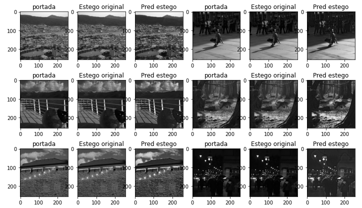

# Genetic-Stego-GAN
Red generativa adversaria evolutiva para el procesamiento de imágenes estenográficas.

## Tecnologías Usadas
* Python
* Tensorflow
* PyGAD

## Base de datos
Se utiliza la base de datos bossbase con un total de 700 imágenes, la mitad para las imágenes esteganográficas y la otra para las de portada. Dicha base de datos se extrajo de [trtroi](https://www.kaggle.com/datasets/lijiyu/bossbase) en la plataforma de Kaggle.

## Resultados
El modelo GAN se baso del trabajo del usuario [KHALED HUSHME](https://www.kaggle.com/code/kaledhoshme/adult-tooth-segmentation-u-net-based-gan) y se le hizo una comparativa usando el mismo modelo pero utilizando algoritmos geneticos en el proceso de entrenamiento. Resultando en la siguiente imagen comparativa: En la izquierda se encuentran las imágenes originales de la base de datos y en la derecha las imágenes generadas por el modelo GAN genético.

  

